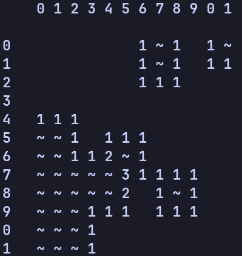

A simple terminal based implementation of [Minesweeper](https://minesweeper.online/)




### Dependencies
- `TypeScript`
- Some `JavaScript` runtime
### Build
Start by cloning the repository.

To install necessary packages run following the command in the root directory of the project (`minesweeper/`)
```
npm i
```

To compile the project run:
```
tsc src/main.ts
```
This will generate a `main.js` file in `minesweeper/src/`

To play the game run:

using `node`:
```
node src/main.js
```

using `bun`:
```
bun src/main.js
```

using `deno`:
```
deno src/main.js
```

### How to Play
>For documentation about the rules of the game, consult [the wiki](https://minesweeper.online/). Note that our implementation doesn't have all the same features as [this implementation](https://minesweeperonline.com/#).

When prompted about `number of rows`, `number of columns` and `number of mines` input *appropriate* amounts, then input a `row` and a `col`, this means selecting the cell at index `(row, col)`. You also have the choice of flagging or revealing the cell, which can be decided by inputting either 0 or 1. The game ends when you have either revealed all empty cells(won) or revealed a cell with a mine(lost).

### tests

To run the tests you need to have `jest` installed. To install it run the following command:

using `npm`:
```
npm i jest
```

Then, to run the tests run:
```
jest
```


